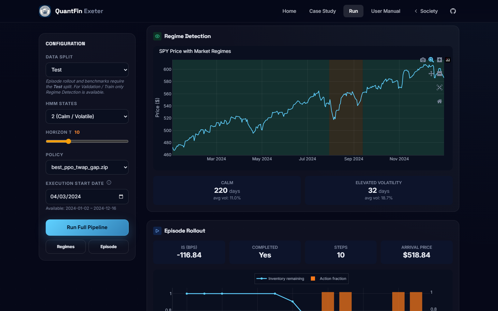
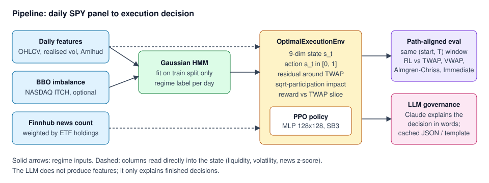
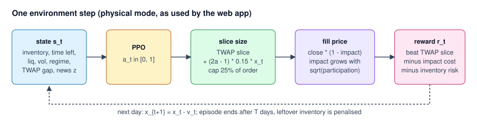
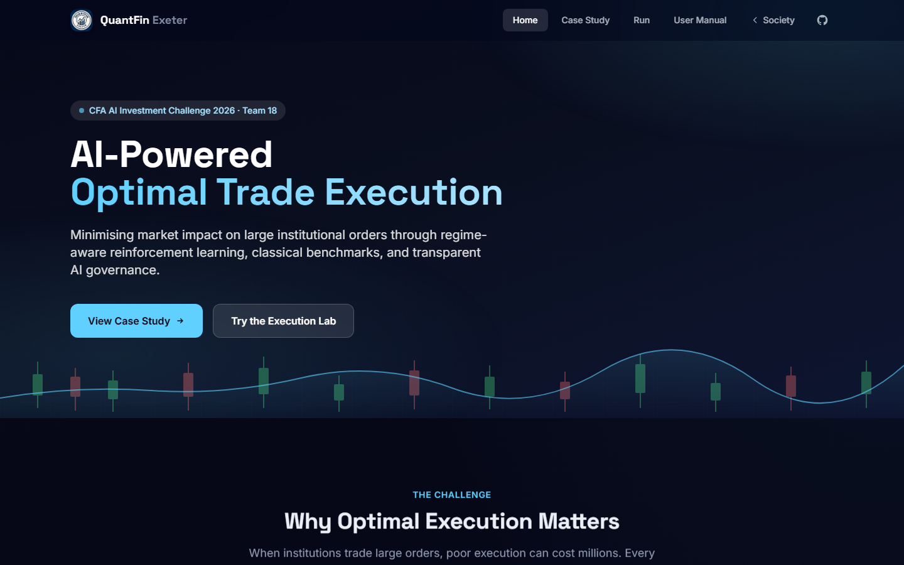
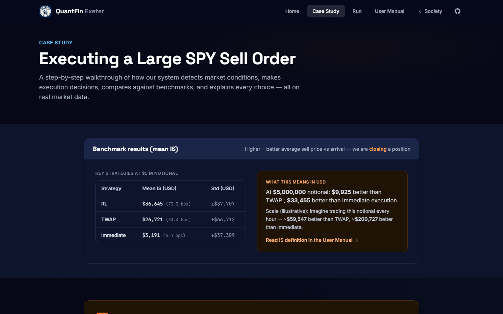
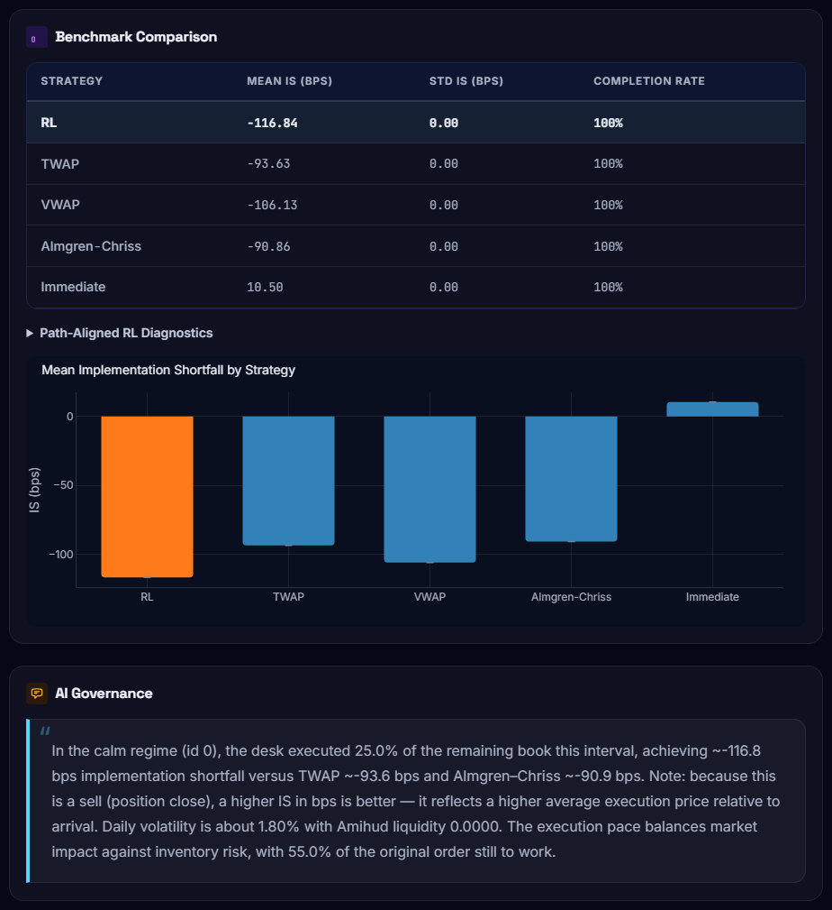
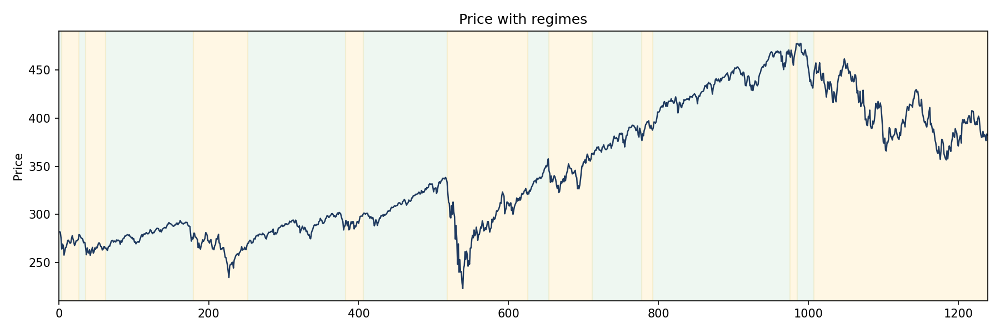

# QuantFin Exeter: regime-aware RL for trade execution

A PPO agent that sells a large SPY position over a few days and tries to beat a TWAP schedule. It uses an HMM market-regime signal, and an LLM layer explains each decision in plain English.

University of Exeter, Team 18 (CFA AI Investment Challenge 2025-26). Live static demo: [quantfin.dev/execution](https://quantfin.dev/execution).



This is a team project. Upstream repository: [KirikPapka/quantfin_exeter](https://github.com/KirikPapka/quantfin_exeter).

---

## Contents

1. [How it works](#how-it-works)
2. [The math](#the-math)
3. [Results](#results)
4. [Screenshots](#screenshots)
5. [Quick start](#quick-start)
6. [Data](#data)
7. [Project layout](#project-layout)
8. [Team](#team)

---

## How it works



1. **Load daily features.** `src/data_pipeline.py` reads `features_{train,val,test}.parquet` (SPY: train 2018-2022, val 2023, test 2024). It builds close, volume, 20-day realised volatility, daily volatility $\sigma_t$, Amihud illiquidity and a volume-to-spread proxy. If `data/processed/bbo_daily.parquet` exists, it merges in the daily NASDAQ ITCH order-book imbalance. If `data/processed/news_daily_SPY.parquet` exists, it merges in a daily `news_count` column (`src/news_features.py`).
2. **Label regimes.** `src/regime_detector.py` fits a Gaussian HMM (full covariance, 2 or 3 states) on the **train split only**. Its inputs are standardised realised volatility, volume-to-spread and (when present) order imbalance. States are sorted by mean volatility, so regime 0 is the calmest. If the fit fails, or a state covers under 5% of days, it falls back to a volatility threshold.
3. **Simulate execution.** `src/trading_env.py` (`OptimalExecutionEnv`) is a Gymnasium environment. One episode is one parent sell order worked over $T$ trading days. Each day the agent chooses how much to sell. The fill price comes from a square-root participation impact model in `src/execution_impact.py`.
4. **Train PPO.** `src/rl_agent.py` trains a Stable-Baselines3 PPO policy. A callback compares the policy with TWAP on fixed windows and keeps the checkpoint with the best mean gap (`models/best_ppo_twap_gap.zip`).
5. **Benchmark.** `src/benchmarks.py` runs TWAP, VWAP, Almgren-Chriss and Immediate on the **same** start day and horizon as each RL episode, using the same impact model.
6. **Explain.** `src/llm_explainer.py` sends the regime, volatility, liquidity, action and benchmark numbers to Claude and asks for a short explanation aimed at a PM or compliance reader. Answers are cached in `data/cached_llm/*.json`. Without an API key, a fixed template is used.
7. **Show it.** `web/app.py` is a Flask app with a home page, case study, interactive Execution Lab and user manual. `web/export.py` pre-renders it to static HTML for the Cloudflare deploy ([DEPLOY.md](DEPLOY.md)).

One environment step, as configured by the web app and the committed checkpoint:



---

## The math

Everything below is written as the code computes it. Where the code has several modes, this section describes the **physical mode** used by the web app and the committed checkpoint: order notional $N = \$5{,}000{,}000$, residual bound $b = 0.15$, relative IS scale $c = 2$ (`web/app.py`, `physical_institutional_kwargs` in `src/trading_env.py`).

### 1. The execution problem

We hold a long position and must sell it within $T$ trading days (default $T = 10$). Let

- $S_t$ = close price on day $t$ of the episode,
- $p_0$ = **arrival price**, the close of the day before the first trading day (`arrival_price_full` in `src/execution_impact.py`),
- $Q = N / p_0$ = shares to sell,
- $v_t$ = shares sold on day $t$, and $x_t$ = shares still held ($x_0 = Q$),
- $p_t$ = average fill price on day $t$.

The score is **implementation shortfall in basis points**, measured against arrival. For a sell, getting more than the arrival price is good, so the code uses the sign convention "higher is better":

$$
\mathrm{IS}_{\text{bps}} \;=\; 10^4 \cdot \frac{\sum_{t} v_t\,(p_t - p_0)}{Q\,p_0}
$$

Any shares left at the end are marked at the last close and added to the numerator (`evaluate_agent` in `src/rl_agent.py`). The benchmarks compute the same quantity as $(\bar p_{\text{fill}} - p_0)/p_0$, where $\bar p_{\text{fill}}$ is the volume-weighted fill price (`src/benchmarks.py`).

### 2. Market impact

Selling $v_t$ shares on a day with volume $V_t$ gives participation $\rho_t = v_t S_t / (V_t S_t) = v_t / V_t$. The fill price is the close minus a fractional impact (`sell_effective_close`, `src/execution_impact.py`):

$$
\iota_t = \operatorname{clip}\Big(0.65\,\sigma_t\sqrt{\min(\rho_t, 12)} \;+\; 0.35\,\mathrm{ILLIQ}_t\,\min(\rho_t, 12),\; 0,\; 0.35\Big),
\qquad p_t = S_t\,(1 - \iota_t)
$$

Here $\sigma_t$ is daily volatility (20-day realised vol divided by $\sqrt{252}$) and $\mathrm{ILLIQ}_t$ is Amihud illiquidity. The square-root term is the standard concave impact law. The Amihud term adds a linear penalty on illiquid days.

### 3. Baselines

**TWAP** sells the same amount every day: $v_t = Q/T$.

**VWAP** splits the order across days in proportion to each day's volume in the window.

**Almgren-Chriss** follows the closed-form optimal path for linear impact $\eta$ and risk aversion $\lambda$:

$$
x_k = Q\,\frac{\sinh\!\big(\kappa\,(T-k)\big)}{\sinh(\kappa T)},\qquad \kappa = \sqrt{\lambda\sigma^2/\eta},\qquad v_k = x_{k-1} - x_k
$$

The web app's benchmark parameters use $\eta = 0.01$ and $\lambda = 0.5$.

**Immediate** sells everything on the first day.

All four use the impact function above, so the comparison is like for like.

### 4. The MDP

**State** (9 numbers, `OptimalExecutionEnv._obs`):

$$
s_t = \Big(\tfrac{x_t}{Q},\;\; \tfrac{T-t}{T},\;\; \tfrac{S_t}{S_{\text{start}}},\;\; z(\mathrm{ILLIQ}_t),\;\; z(\sigma_t),\;\; r_t,\;\; \operatorname{clip}\!\big(\tfrac{S_t}{p_0}-1, \pm 0.5\big),\;\; g_t,\;\; \operatorname{clip}\!\big(z(\text{news}_t), \pm 4\big)\Big)
$$

- $z(\cdot)$ is a z-score using that column's mean and standard deviation over the split the env was built on.
- $r_t$ is the HMM regime label.
- $g_t$ is the **TWAP gap**, which measures how far ahead of or behind a straight-line schedule we are: $g_t = \operatorname{clip}\big(\tfrac{x_t}{Q} - \tfrac{T-t}{T}, \pm 1\big)$. A positive value means we still hold more than TWAP would.

**Action.** $a_t \in [0, 1]$. With a residual bound $b$, the action tilts the TWAP slice up or down rather than setting a raw fraction. Writing $\tilde x_t = x_t / Q$:

$$
f_t = \operatorname{clip}\!\Big(\frac{\tilde x_t}{T - t} \;+\; (2a_t - 1)\, b\, \tilde x_t,\;\; 0,\;\; \tilde x_t\Big),
\qquad v_t = Q \cdot \min(f_t,\, 0.25)
$$

So $a_t = 0.5$ means "sell the TWAP amount for the days left", and the extremes move that by $\pm 15\%$ of what is still held. The $0.25$ cap (`max_inventory_fraction_per_step`) stops any single day from selling more than a quarter of the original order.

**Reward.** Define the agent's leg and a reference TWAP leg on the same day, both as fractions of order notional:

$$
A_t = \frac{v_t\,(p_t - p_0)}{Q\,p_0},\qquad
B_t = \frac{q\,(p^{\text{TWAP}}_t - p_0)}{Q\,p_0},\qquad q = \frac{Q}{T}
$$

$p^{\text{TWAP}}_t$ is the impact-adjusted fill a TWAP slice of size $q$ would get that day. Let $C_t = v_t (p_0 - p_t)/(Q p_0)$ be the shortfall on today's trade. When $v_t > 0$, the step reward is (`OptimalExecutionEnv.step`):

$$
r_t \;=\; \underbrace{c\,(A_t - B_t)}_{\text{beat TWAP today}} \;-\; \underbrace{0.2\,\kappa_{\text{IS}}\, C_t}_{\text{absolute cost}} \;-\; \underbrace{\lambda\,\tilde x_t^{\,2}\,\sigma_t^2\,\Big(\tfrac{T-t}{T}\Big)^{1.5}}_{\text{inventory risk}} \;+\; \underbrace{\beta\,(A_t - B_t)}_{\text{TWAP slice bonus}}
$$

with $c = 2$, $\kappa_{\text{IS}} = 1.28$, $\lambda = 0.22$ and $\beta = 0.60$. When $v_t = 0$, the TWAP-relative terms are skipped and only the inventory-risk term applies. At the end of the episode:

$$
r_T \mathrel{+}= \begin{cases} +0.05 & \text{if the order is fully sold} \\ -5\,\tilde x_T^{\,2} & \text{otherwise} \end{cases}
$$

Why the reward is built this way: raw IS is dominated by how the market moves over the window, which the agent cannot control. Rewarding $A_t - B_t$ cancels most of that shared market move, so the agent learns *timing relative to TWAP*, which is the thing we want to measure.

### 5. PPO as used

`train_agent` in `src/rl_agent.py` uses Stable-Baselines3 PPO with an MLP policy: separate actor and critic networks, each with two hidden layers of 128 units. PPO maximises the clipped surrogate

$$
L^{\text{CLIP}}(\theta) = \mathbb{E}_t\Big[\min\big(\rho_t(\theta)\,\hat A_t,\;\operatorname{clip}(\rho_t(\theta),\,1-\epsilon,\,1+\epsilon)\,\hat A_t\big)\Big],
\qquad \rho_t(\theta) = \frac{\pi_\theta(a_t\mid s_t)}{\pi_{\theta_{\text{old}}}(a_t\mid s_t)}
$$

using advantages from generalised advantage estimation (GAE):

$$
\delta_t = r_t + \gamma V(s_{t+1}) - V(s_t),\qquad \hat A_t = \sum_{l \ge 0} (\gamma\lambda_{\text{GAE}})^l\, \delta_{t+l}
$$

The full loss SB3 minimises is $-L^{\text{CLIP}} + c_v\,(V_\theta - \hat R)^2 - c_e\,\mathcal{H}[\pi_\theta]$, where $c_v = 0.5$ is the SB3 default.

| Hyperparameter | Value |
|---|---|
| clip $\epsilon$ | 0.2 |
| $\gamma$ | 0.99 |
| $\lambda_{\text{GAE}}$ | 0.95 |
| entropy $c_e$ | 0.003 |
| learning rate | linear 3e-4 to 5e-5 |
| rollout / batch / epochs | 2048 / 128 / 8 |
| max grad norm | 0.5 |
| timesteps (default) | 300,000 |

Each training episode starts on a random day of the training split. Every 25,000 steps, a callback runs 24 fixed windows on the validation split (or the test split if val is missing) and saves the checkpoint with the highest mean RL minus TWAP gap. Some optional extras exist but are off by default: behaviour-cloning warm start (`src/bc_warmstart.py`), offline CQL (`src/offline_cql.py`), ensembles (`src/ensemble.py`) and trend-based policy switching (`src/regime_switching.py`).

### 6. How news and the LLM enter

News and the LLM play two different roles:

- **News is a feature.** `scripts/fetch_finnhub_news.py` pulls Finnhub company news for SPY's top holdings and builds a holdings-weighted daily article count, $\text{news}_t = \sum_i w_i \cdot \text{articles}_{i,t}$, with weights renormalised over the top $N$ names. The count is merged by date and enters the state as the clipped z-score in the last slot of $s_t$. It counts articles and carries no sentiment score.
- **The LLM is not a feature.** Claude never sees any data before the decision and never changes the action. It receives the finished decision (regime, $\sigma_t$, liquidity, fraction sold, IS vs TWAP and Almgren-Chriss) and writes a 3-5 sentence explanation. The prompt and the cache-key logic are in `src/llm_explainer.py`.

A caveat on the committed data: `news_daily_SPY.parquet` starts in September 2025, so it does not overlap the 2018-2024 feature panels. With the committed data, the news slot is therefore zero on every day (the training log reports `nonzero days: 0`). The news pipeline works, but the committed model did not learn anything from news.

### 7. Evaluation metrics

`evaluate_agent` (`src/rl_agent.py`) runs the deterministic policy on 200 fixed $(\text{start}, \text{seed})$ windows from `models/fixed_eval_starts.json`, and runs TWAP and VWAP on the same windows. For episode $i$, let $d_i = \mathrm{IS}^{\text{RL}}_i - \mathrm{IS}^{\text{TWAP}}_i$.

| Metric | Definition |
|---|---|
| `mean_is_bps` | $\frac1n\sum_i \mathrm{IS}^{\text{RL}}_i$ |
| `mean_rl_minus_twap_bps` | $\bar d = \frac1n\sum_i d_i$ |
| `pct_beat_twap_is` | share of windows with $d_i > 0$ |
| `is_gap_sharpe` | $\bar d / \operatorname{std}(d)$ |
| 95% CI | bootstrap percentile interval of $\bar d$ |
| per-regime / per-trend gap | $\bar d$ grouped by HMM regime and by 20-day trend label (down / mid / up) |
| `completion_rate` | share of episodes that end with less than 1% of the order left |

---

## Results

These numbers come from running the committed checkpoint in eval-only mode on the 2024 test split: 200 fixed windows, $T = 10$, USD 5M notional.

```bash
python scripts/train.py --ticker SPY --order-notional-usd 5e6 --residual-bound 0.15 \
  --relative-is-scale 2.0 --fixed-eval-starts models/fixed_eval_starts.json \
  --load-model models/best_ppo_twap_gap.zip
```

| Strategy | Mean IS (bps) | Std IS (bps) | Completion |
|---|---:|---:|---:|
| **PPO (RL)** | **73.47** | 175.67 | 100% |
| TWAP | 53.44 | 133.42 | 100% |
| Almgren-Chriss | 52.28 | 131.28 | 100% |
| VWAP | 44.39 | 139.65 | 100% |
| Immediate | 6.38 | 74.62 | 100% |

Path-aligned comparison on the same windows:

| Metric | Value |
|---|---:|
| Mean RL minus TWAP | +20.02 bps |
| 95% bootstrap CI | [12.35, 27.68] bps |
| Std of the gap | 55.54 bps |
| Beat TWAP | 68% of windows |
| Beat VWAP | 71% of windows |
| Gap Sharpe | 0.36 |
| Gap in regime 0 (calm), n=177 | +16.71 bps |
| Gap in regime 1 (volatile), n=23 | +45.53 bps |
| Gap in downtrend / mid / uptrend (n=18 / 57 / 125) | +89.82 / +5.93 / +16.40 bps |

How to read this: the positive IS values mostly reflect SPY rising through 2024, since selling later got a better price than arrival. The number that matters is the gap to TWAP on identical windows. That gap is positive, and its confidence interval excludes zero. RL is also more volatile than TWAP (std 176 vs 133 bps), and the regime-1 and downtrend buckets are small samples. The web app's case study shows the same RL, TWAP and Immediate means.

Limits: daily bars only, a stylised (not calibrated) impact model, one ticker and one test year.

---

## Screenshots

| | |
|---|---|
|  |  |
| Home page | Case study: mean IS in USD and bps at USD 5M |
|  |  |
| Execution Lab: one episode (start 2024-04-03, T=10) with the governance text | HMM regimes on the 2018-2022 train split (from the notebook) |

The single-episode panel is a typical example, not a best case: on that window RL scored -116.8 bps against TWAP's -93.6 bps. Single windows are noisy, so judge the strategy on the 200-window table above.

---

## Quick start

Python 3.12. From the repo root:

```bash
pip install -r requirements.txt     # or: bash build.sh  (installs CPU-only torch first)
pytest -q                           # 26 tests
python -m web.app                   # http://localhost:5001
```

No API keys are needed. The feature panels (`deploy_data/features/`), the PPO checkpoint (`models/best_ppo_twap_gap.zip`) and the LLM cache (`data/cached_llm/`) are all committed. Copy `.env.example` to `.env` only if you want live Claude calls (`ANTHROPIC_API_KEY`), Finnhub news (`FINNHUB_API_KEY`) or your own data (`CFA_DATA_ROOT`).

The eval command in [Results](#results) reproduces the tables. To train from scratch (not re-run for this README):

```bash
python scripts/train.py --ticker SPY --train --order-notional-usd 5e6 \
  --residual-bound 0.15 --relative-is-scale 2.0 --timesteps 300000
```

The static site build is described in [DEPLOY.md](DEPLOY.md).

Windows note: if a script fails with `WinError 1114` while loading `torch`, import torch before anything else. For example:
`python -c "import torch, runpy, sys; sys.argv=['scripts/train.py','--ticker','SPY','--order-notional-usd','5e6']; runpy.run_path('scripts/train.py', run_name='__main__')"`.

The notebook `notebooks/main_notebook.ipynb` walks through data loading, regime fitting, one environment episode and the LLM explanations.

---

## Data

All sources are public.

| Data | Source | Location | Needed? |
|---|---|---|---|
| Daily SPY features | any daily OHLCV source; schema in `load_features_parquet` (`src/data_pipeline.py`) | `deploy_data/features/` or `$CFA_DATA_ROOT/features/` | yes (committed) |
| Order-book imbalance | Databento NASDAQ TotalView-ITCH BBO-1m, built with `scripts/build_bbo_daily.py` | `data/processed/bbo_daily.parquet` | optional (committed) |
| News counts | Finnhub free API, `scripts/fetch_finnhub_news.py --symbol SPY --etf-proxy` | `data/processed/news_daily_SPY.parquet` | optional (committed; see the caveat above) |
| LLM explanations | Anthropic Claude (`claude-sonnet-4-20250514` by default) | `data/cached_llm/*.json` | optional (committed cache) |

---

## Project layout

```
src/
  data_pipeline.py      load parquet splits, merge BBO and news
  regime_detector.py    Gaussian HMM with volatility fallback
  trading_env.py        Gymnasium execution environment (state, action, reward)
  execution_impact.py   square-root participation impact, arrival price
  benchmarks.py         TWAP, VWAP, Almgren-Chriss, Immediate
  rl_agent.py           PPO training, path-aligned evaluation, bootstrap CI
  news_features.py      merge daily news counts
  finnhub_etf.py        ETF holdings weights for the news proxy
  llm_explainer.py      Claude prompt, cache, offline template
  trend_classifier.py, regime_switching.py, bc_warmstart.py, offline_cql.py, ensemble.py
scripts/                train.py, scenario_benchmarks.py, build_bbo_daily.py, fetch_finnhub_news.py, llm_demo.py
web/                    Flask app, static export, templates, JS charts
notebooks/              main_notebook.ipynb
models/                 best_ppo_twap_gap.zip, fixed_eval_starts.json
deploy_data/features/   train / val / test parquet panels
data/                   processed BBO and news parquet, cached LLM answers
tests/                  pytest suite
docs/media/             README images and diagrams
CODEBASE_GUIDE.tex      longer walkthrough of the code
DEPLOY.md               Cloudflare deploy
```

---

## Team

University of Exeter, Team 18. This is a joint project by:

- **Kirill Papka** ([@KirikPapka](https://github.com/KirikPapka)), who owns the upstream repository
- **Maksim (Max) Kitikov**
- **Thomas Nguyen** ([@duc-minh-droid](https://github.com/duc-minh-droid))
- **Harrison Maxwell**

Upstream: [github.com/KirikPapka/quantfin_exeter](https://github.com/KirikPapka/quantfin_exeter). This copy is a fork.

AI tools: the governance layer calls Anthropic Claude at run time, with responses cached for reproducibility. Development used Cursor IDE with Claude.

Licence: MIT, see [LICENSE](LICENSE).
